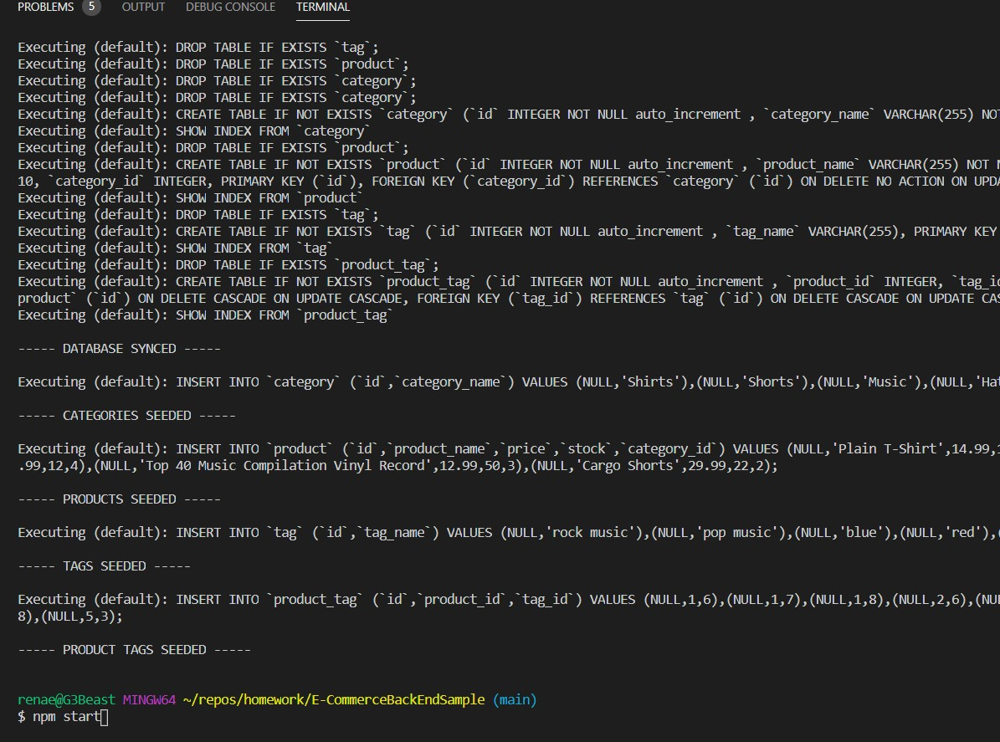
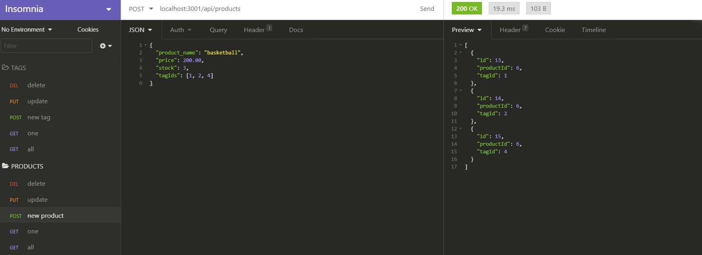

# E-Commerce Back End Sample

  
  ## Description
   
   This is the back end of a e-commerce site. Even before the pandemic era, e-commerce was a huge part of the electronics and shopping industries. So, for any commercial enterprise, having an e-commerce option is imperative for success. Paired with a front end, this back end logic will help organize, retrieve, and update entries for all of a company's products.

   The app uses an Express server to serve the data and Sequelize to interact with the mySQL database. There are three endpoints accessible at /categories, /products, and /tags. Each endpoint is accessible with a GET, POST, PUT, or DELETE route to get all items, get one item by its ID, post/create a new item, update an existing item by ID, and delete an item by its ID.
    
  

  
  
  ## Table of Contents
  
  * [Description](#description)
  * [Installation](#installation)
  * [Usage](#usage)
  * [Tests](#tests)
  * [Future](#futureFeatures)
  * [Contributing](#contributing)
  * [License](#license)
  * [Questions](#questions)
    
  ## Installation
  Run npm i
  
  ## Usage
  1. Clone the repo to local directory
  1. Open repo in VSCode
  1. Add your MySQL user and password data to the .env file
  1. Open your preferred MySQL GUI
  1. Copy schema file into the GUI and run to create the database
  1. Back in VSCode, open integrated terminal to repo
  1. Install dependencies
  1. Seed some data by running npm run seed
  1. Start the server with npm run start
  1. Open your preferred API client like Insomnia Core
  1. Send GET, POST, PUT, and DELETE requests to localhost:3001/api/ with endpoints at categories, products, and tags.
  
  
  [Demo Video](https://drive.google.com/file/d/1x744gaYBJykgt-OngVAhElwUF7nL9e-i/view)
  
  ## Tests
  While there are no test suites, you can test the functionality of this app with the seed data by running `npm run seed` in your terminal to seed testing data and using an API client application like Insomnia Core to interact with all of the routes.
  
  ## License
  [MIT License](https://choosealicense.com/licenses/mit/)
  
  ## Contributing
  To contribute to this repo:
  1. Fork the repo
  1. Make changes to forked repo
  1. Submit pull request to this repo
  
  ## FutureFeatures
This app needs a front end. As of now, it is an example of the back-end logic for an e-commerce site, but it is not functional without an API client like Insomnia.

  ## Questions
  
  For more information:
  Visit my GitHub: [https://rsowald.github.io](https://rsowald.github.io)

  or Email: renaesowald@gmail.com